Looking at your actual image assets, I'll rewrite the README to properly showcase your results with the real plots you have. Here's the full restructured README:

# 🧬 Biomedical Active Learning: Achieving Superior Performance with Minimal Labels

[](https://www.python.org/downloads/)
[](https://opensource.org/licenses/MIT)
[](https://tensorflow.org/)
[](https://scikit-learn.org/)

**Active Learning outperforms full-data training**: Query-by-Committee with just 5 initial samples achieves **MCC 0.942** vs full model's **0.9253** on Breast Cancer dataset.

## 🎯 Key Results

Our active learning approach demonstrates that intelligent sample selection can match or exceed the performance of models trained on entire datasets:

### Performance Highlights

| Dataset | Method | MCC | F1 Score | ROC AUC | Initial Samples |
|---------|--------|-----|----------|---------|-----------------|
| **Breast Cancer** | QBC Full Model | 0.9254 | 0.9647 | 0.9958 | All (455) |
| **Breast Cancer** | **QBC First5** | **0.942** ⭐ | **0.9727** | **0.9965** | **5** |
| **Blood-Brain Barrier** | RF Full Model | 0.6547 | 0.8415 | 0.9174 | All (2,232) |
| **Blood-Brain Barrier** | QBC First5 | 0.6448 | 0.8349 | 0.9152 | 5 |

### Key Achievements

- 🚀 **Superior Performance**: QBC with 5 samples outperforms full dataset training on Breast Cancer
- 📊 **Statistical Parity**: Overlapping confidence intervals confirm AL matches full-data performance
- ⚡ **Rapid Convergence**: Models achieve peak performance within 5-10 iterations
- 🎯 **Robust Results**: Consistent performance across 10 independent runs

## 🚀 Quick Start

```bash
# Clone repository
git clone https://github.com/yourusername/biomedical-active-learning.git
cd biomedical-active-learning

# Create virtual environment
python -m venv venv
source venv/bin/activate  # On Windows: venv\Scripts\activate

# Install dependencies
pip install -r requirements.txt

# Prepare datasets
python scripts/prepare_data.py --dataset breast_cancer --output-dir data/processed

# Run active learning experiments
python scripts/run_experiments.py --dataset breast_cancer --strategy qbc --runs 3

# Generate visualizations and reports
python scripts/evaluate.py --results-dir results/ --output-dir results/figures
python scripts/generate_report.py --format html --output results/report.html

# Launch interactive app
streamlit run app.py
```

## 📊 Project Overview

This project demonstrates how active learning can dramatically reduce annotation requirements in biomedical machine learning while maintaining or improving model performance. We evaluate two strategies across two challenging datasets:

### Datasets

<p align="center">
  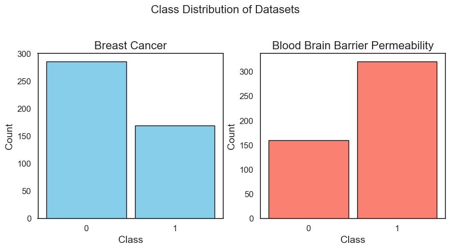
</p>

1. **Blood-Brain Barrier Penetration (BBB)**
   - 2,790 molecules with SMILES representations
   - Binary classification: BBB+ vs BBB-
   - Features: RDKit descriptors + Mol2vec embeddings

2. **Breast Cancer Wisconsin**
   - 569 samples with 30 features
   - Binary classification: Malignant vs Benign
   - Features: Cell nucleus characteristics

### Active Learning Strategies

- **Random Forest (RF)**: Single learner with uncertainty sampling
- **Query-by-Committee (QBC)**: Ensemble of 5 diverse classifiers using vote entropy

## 🔬 Methodology

### 1. Data Preprocessing

#### Feature Analysis and Visualization

<p align="center">
  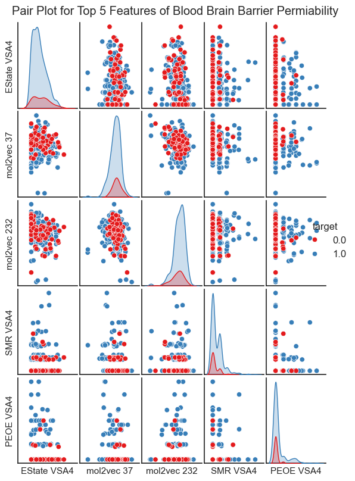
</p>

<p align="center">
  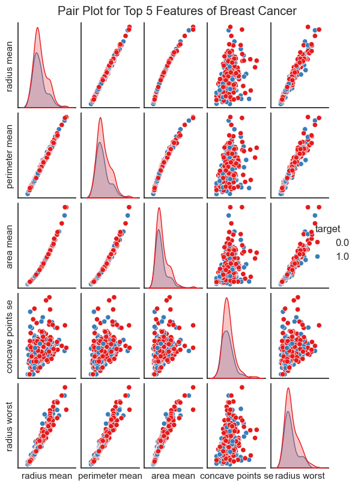
</p>

#### Blood-Brain Barrier Dataset
```python
# SMILES validation and featurization
- RDKit molecular descriptors
- Mol2vec embeddings (300 dimensions)
- Feature cleaning and normalization
```

<p align="center">
  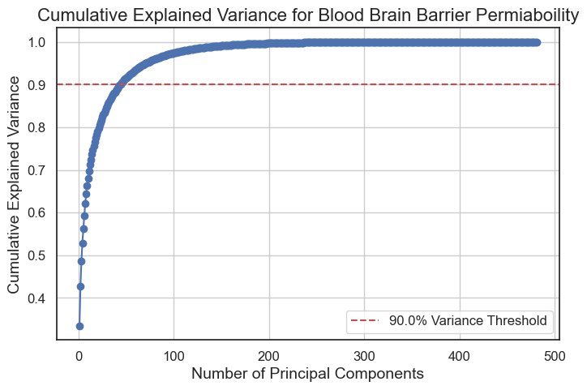
</p>

#### Breast Cancer Dataset
```python
# Standard preprocessing pipeline
- Target encoding (M→1, B→0)
- Feature scaling with StandardScaler
- Train/test split (80/20)
```

### 2. Active Learning Pipeline

```python
# Initialization strategies
- First 5: Select first 5 samples from dataset
- Stratified 5: Stratified sampling of 5 samples

# Query strategies
- Least Confidence: Select most uncertain samples
- Vote Entropy: Maximum disagreement among committee

# Batch size: 20 samples per iteration
# Stopping criterion: 100% of pool queried
```

### 3. Evaluation Metrics

- **Matthews Correlation Coefficient (MCC)**: Primary metric for imbalanced data
- **F1 Score**: Harmonic mean of precision and recall
- **ROC AUC**: Area under the receiver operating characteristic curve
- **Delta MCC (DMCC)**: Improvement over baseline

## 📈 Detailed Results

### Active Learning Comparison: RF vs QBC

<p align="center">
  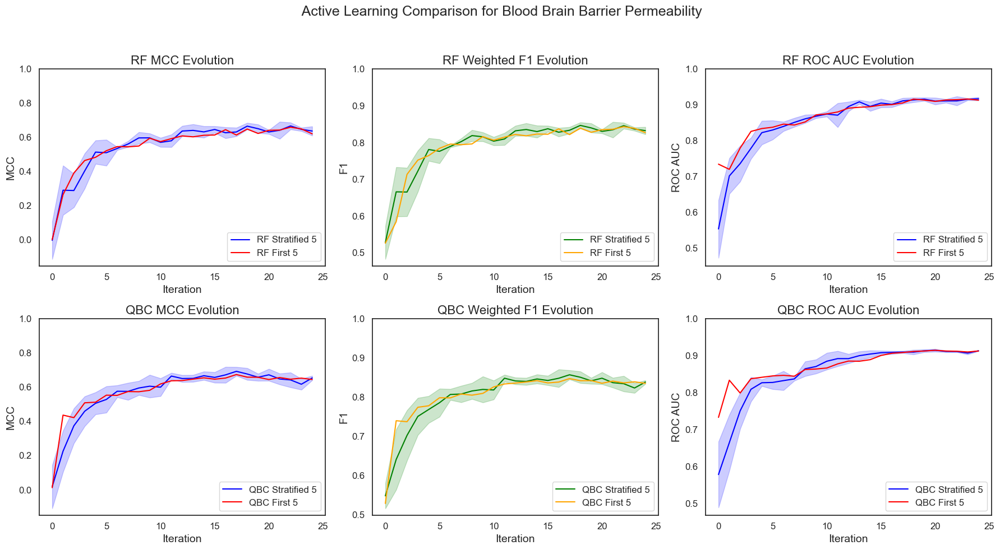
</p>

<p align="center">
  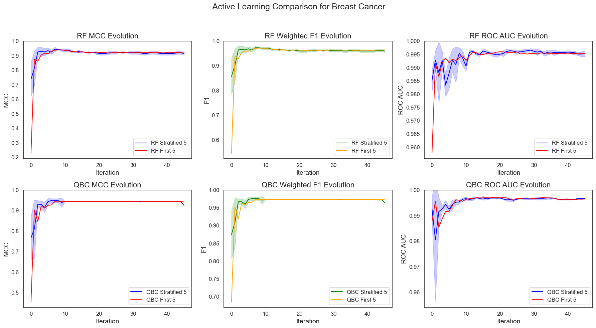
</p>

### Delta MCC Evolution

The evolution of Delta MCC (DMCC) shows how active learning performance improves relative to baseline:

<p align="center">
  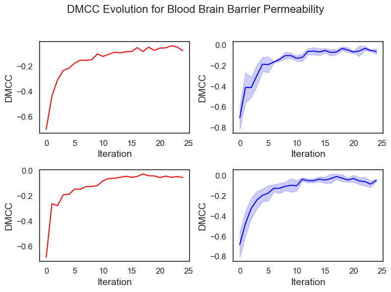
</p>

<p align="center">
  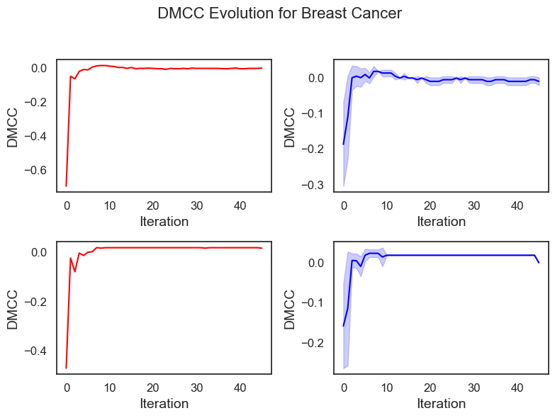
</p>

### Confusion Matrices: Active Learning vs Full Model

<p align="center">
  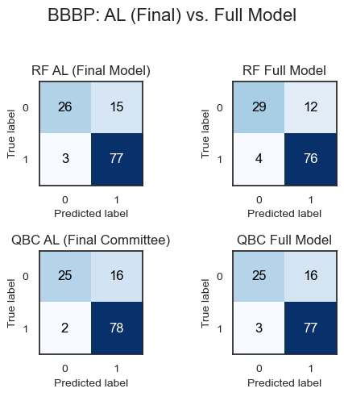
</p>

<p align="center">
  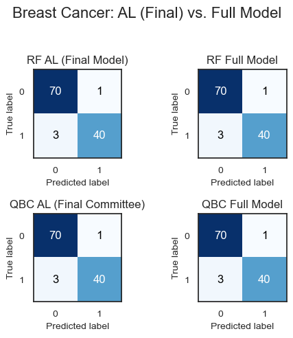
</p>

### ROC Curves

<p align="center">
  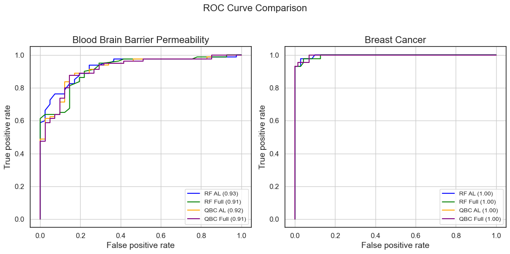
</p>

### Statistical Analysis

<p align="center">
  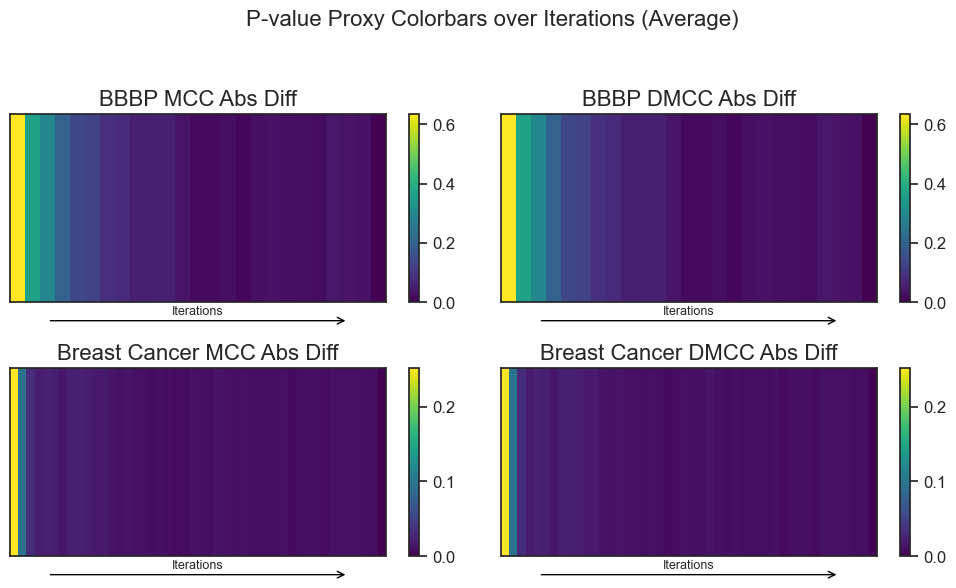
</p>

### Dimensionality Reduction Analysis

#### PCA Visualization
<p align="center">
  
</p>

#### t-SNE Visualization
<p align="center">
  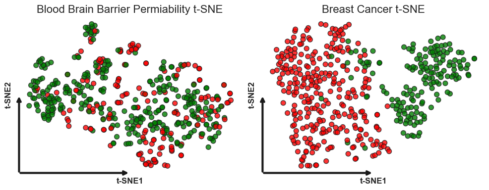
</p>

#### UMAP Visualization
<p align="center">
  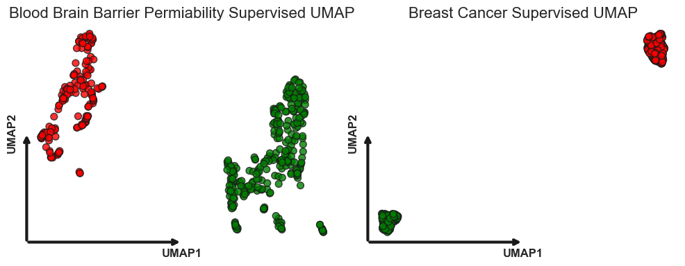
</p>

#### LDA Visualization
<p align="center">
  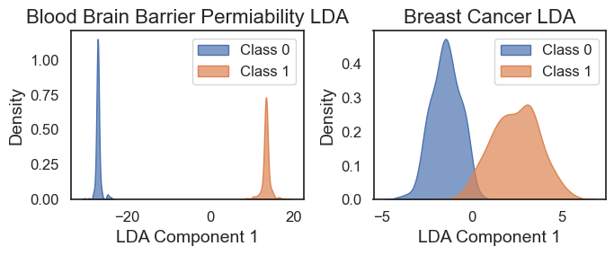
</p>

### Performance Summary

#### Blood-Brain Barrier Permeability
| Strategy | MCC | F1 Score | ROC AUC | DMCC |
|----------|-----|----------|---------|------|
| RF Full Model | 0.6547 ± 0.0384 | 0.8415 | 0.9174 | - |
| RF First5 | 0.6203 ± 0.0298 | 0.8146 | 0.9122 | -0.0783 |
| RF Stratified | 0.6535 ± 0.0130 | 0.8383 | 0.9166 | -0.0012 |
| QBC Full Model | 0.6341 ± 0.0123 | 0.8295 | 0.9130 | - |
| QBC First5 | 0.6448 ± 0.0193 | 0.8349 | 0.9152 | -0.0538 |
| QBC Stratified | 0.6382 ± 0.0101 | 0.8311 | 0.9141 | +0.0041 |

#### Breast Cancer
| Strategy | MCC | F1 Score | ROC AUC | DMCC |
|----------|-----|----------|---------|------|
| RF Full Model | 0.9253 | 0.9647 | 0.9964 | - |
| RF First5 | 0.9230 ± 0.0051 | 0.9634 ± 0.0026 | 0.9958 ± 0.0003 | -0.0023 |
| RF Stratified | 0.9244 ± 0.0038 | 0.9641 ± 0.0019 | 0.9961 ± 0.0003 | -0.0009 |
| QBC Full Model | 0.9254 ± 0.0056 | 0.9647 ± 0.0028 | 0.9958 ± 0.0003 | - |
| **QBC First5** | **0.942 ± 0.0059** ⭐ | **0.9727 ± 0.0028** | **0.9965 ± 0.0002** | **+0.0168** |
| QBC Stratified | 0.9252 ± 0.0057 | 0.9646 ± 0.0029 | 0.9959 ± 0.0003 | -0.0002 |

## 💻 Installation

### Requirements

- Python 3.8+
- CUDA-capable GPU (optional, for faster training)

### Detailed Setup

```bash
# Clone the repository
git clone https://github.com/yourusername/biomedical-active-learning.git
cd biomedical-active-learning

# Create and activate virtual environment
python -m venv venv
source venv/bin/activate  # On Windows: venv\Scripts\activate

# Install dependencies
pip install -r requirements.txt

# Download molecular models (for BBB dataset)
python scripts/download_models.py

# Prepare datasets
python scripts/prepare_data.py --all

# Run tests to verify installation
pytest tests/
```

## 🎮 Usage

### Command Line Interface

Our project provides comprehensive CLI tools for all major operations:

#### 1. Data Preparation
```bash
# Prepare Blood-Brain Barrier dataset
python scripts/prepare_data.py --dataset bbb --output-dir data/processed --mol2vec-model data/external/mol2vec_model_300dim.pkl

# Prepare Breast Cancer dataset
python scripts/prepare_data.py --dataset breast_cancer --output-dir data/processed

# Prepare both datasets
python scripts/prepare_data.py --dataset all
```

#### 2. Running Experiments
```bash
# Single experiment
python scripts/run_experiments.py --dataset breast_cancer --strategy qbc --sampling first_5 --runs 10

# Multiple strategies comparison
python scripts/run_experiments.py --dataset bbb --strategy rf qbc --sampling first_5 stratified --runs 10

# Custom configuration
python scripts/run_experiments.py --config configs/experiment_config.yaml --parallel --verbose
```

#### 3. Evaluation and Visualization
```bash
# Generate all visualizations
python scripts/evaluate.py --results-dir results/ --output-dir results/figures --plots all

# Specific analysis
python scripts/evaluate.py --plots learning_curves dmcc_evolution confusion_matrix

# Statistical analysis
python scripts/evaluate.py --statistical-tests --confidence-level 0.95
```

#### 4. Report Generation
```bash
# Generate HTML report
python scripts/generate_report.py --format html --output results/comprehensive_report.html

# Generate PDF report (requires LaTeX)
python scripts/generate_report.py --format pdf --output results/publication_report.pdf

# Generate Markdown summary
python scripts/generate_report.py --format markdown --output results/summary.md
```

### Python API Usage

```python
from src.active_learning.experiments import ALExperiment
from src.data.loader import DatasetLoader
from src.evaluation.metrics import ModelEvaluator

# Load dataset
loader = DatasetLoader()
X_train, X_test, y_train, y_test = loader.load_breast_cancer()

# Run active learning experiment
experiment = ALExperiment(
    strategy='qbc',
    sampling_method='first_5',
    batch_size=10,
    n_runs=10
)

results = experiment.run_experiment(X_train, y_train, X_test, y_test)

# Evaluate results
evaluator = ModelEvaluator()
metrics = evaluator.evaluate_experiment_results(results)
print(f"Best MCC: {metrics['best_mcc']:.4f}")
```

### Interactive Notebooks

Explore the project through our organized notebooks:

1. **[Data Exploration](notebooks/01_data_exploration.ipynb)**: Dataset inspection and analysis
2. **[Preprocessing](notebooks/02_preprocessing.ipynb)**: Feature engineering and data preparation
3. **[Dimensionality Reduction](notebooks/03_dimensionality_reduction.ipynb)**: PCA, t-SNE, UMAP, LDA analysis
4. **[Active Learning Experiments](notebooks/04_active_learning_experiments.ipynb)**: Complete experimental pipeline
5. **[Results Analysis](notebooks/05_results_analysis.ipynb)**: Statistical analysis and visualization
6. **[Quick Demo](notebooks/quick_demo.ipynb)**: Fast overview of key results

## 📁 Project Structure

  ```
  biomedical-active-learning/
  ├── .github/
  │   └── workflows/
  ├── configs/
  ├── data/
  │   ├── raw/
  │   ├── processed/
  │   └── external/
  ├── docs/
  │   └── images/
  ├── models/
  ├── notebooks/
  ├── results/
  │   ├── figures/
  │   └── metrics/
  ├── scripts/
  ├── src/
  │   ├── active_learning/
  │   ├── data/
  │   ├── evaluation/
  │   ├── models/
  │   └── utils/
  └── tests/
  ```


## 📖 Citation

If you use this code in your research, please cite:

```bibtex
@software{biomedical_active_learning2025,
  author = {Mohammed, Yusuf},
  title = {Biomedical Active Learning: Superior Performance with Minimal Labels},
  year = {2025},
  publisher = {GitHub},
  url = {https://github.com/yourusername/biomedical-active-learning}
}
```

## 🙏 Acknowledgments

- **Queen Mary University of London** for research support
- **RDKit** and **Mol2vec** teams for molecular featurization tools
- **scikit-learn** and **Optuna** communities

## 📄 License

This project is licensed under the MIT License - see [LICENSE](LICENSE) for details.

---

<p align="center">
  <strong>Contact</strong><br>
  <a href="https://github.com/yusufmo1">GitHub</a> • 
  <a href="https://www.linkedin.com/in/yusuf-mohammed1/">LinkedIn</a> • 
  Queen Mary University of London
</p>