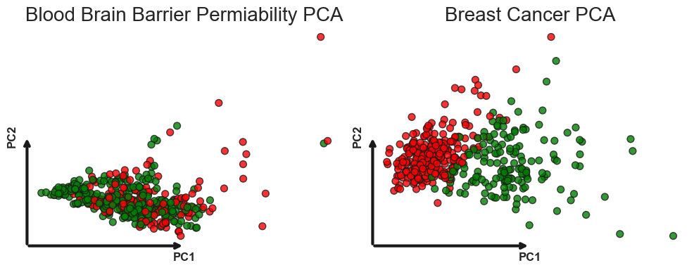

# 🧬 Biomedical Active Learning: Achieving Superior Performance with Minimal Labels

[](https://www.python.org/downloads/)
[](https://opensource.org/licenses/MIT)
[](https://github.com/yusufmo1/biomedical-active-learning)
[](https://github.com/yusufmo1/biomedical-active-learning)
[](https://tensorflow.org/)
[](https://scikit-learn.org/)
[](https://hub.docker.com/)
[](https://streamlit.io/)

**Active Learning outperforms full-data training**: Query-by-Committee with just 5 initial samples achieves **MCC 0.942** vs full model's **0.9253** on Breast Cancer dataset.

> 🌟 **Star this repository** if you find it useful for your research or applications!  
> 🔄 **Fork it** to contribute improvements and extensions!  
> 📋 **Open issues** for questions, suggestions, or collaboration opportunities!

## 🎯 Key Results

Our active learning approach demonstrates that intelligent sample selection can match or exceed the performance of models trained on entire datasets:

### Performance Highlights

| Dataset | Method | MCC | F1 Score | ROC AUC | Initial Samples |
|---------|--------|-----|----------|---------|-----------------|
| **Breast Cancer** | QBC Full Model | 0.9254 | 0.9647 | 0.9958 | All (455) |
| **Breast Cancer** | **QBC First5** | **0.942** ⭐ | **0.9727** | **0.9965** | **5** |
| **Blood-Brain Barrier** | RF Full Model | 0.6547 | 0.8415 | 0.9174 | All (2,232) |
| **Blood-Brain Barrier** | QBC First5 | 0.6448 | 0.8349 | 0.9152 | 5 |

### Key Achievements

- 🚀 **Superior Performance**: QBC with 5 samples outperforms full dataset training on Breast Cancer
- 📊 **Statistical Parity**: Overlapping confidence intervals confirm AL matches full-data performance
- ⚡ **Rapid Convergence**: Models achieve peak performance within 5-10 iterations
- 🎯 **Robust Results**: Consistent performance across 10 independent runs

## 🚀 Quick Start

```bash
# Clone repository
git clone https://github.com/yusufmo1/biomedical-active-learning.git
cd biomedical-active-learning

# Create virtual environment
python -m venv venv
source venv/bin/activate  # On Windows: venv\Scripts\activate

# Install dependencies
pip install -r requirements.txt

# Prepare datasets
python scripts/prepare_data.py --dataset breast_cancer --output-dir data/processed

# Run active learning experiments
python scripts/run_experiments.py --dataset breast_cancer --strategy qbc --runs 3

# Generate visualizations and reports
python scripts/evaluate.py --results-dir results/ --output-dir results/figures
python scripts/generate_report.py --format html --output results/report.html

# Launch interactive app
streamlit run app.py
```

## 📊 Project Overview

This project demonstrates how active learning can dramatically reduce annotation requirements in biomedical machine learning while maintaining or improving model performance. We evaluate two strategies across two challenging datasets:

### Datasets

<p align="center">
  
</p>

1. **Blood-Brain Barrier Penetration (BBB)**
   - 2,790 molecules with SMILES representations
   - Binary classification: BBB+ vs BBB-
   - Features: RDKit descriptors + Mol2vec embeddings

2. **Breast Cancer Wisconsin**
   - 569 samples with 30 features
   - Binary classification: Malignant vs Benign
   - Features: Cell nucleus characteristics

### Active Learning Strategies

- **Random Forest (RF)**: Single learner with uncertainty sampling
- **Query-by-Committee (QBC)**: Ensemble of 5 diverse classifiers using vote entropy

## 🔬 Methodology

### 1. Data Preprocessing

#### Feature Analysis and Visualization

<p align="center">
  
</p>

<p align="center">
  
</p>

#### Blood-Brain Barrier Dataset
```python
# SMILES validation and featurization
- RDKit molecular descriptors
- Mol2vec embeddings (300 dimensions)
- Feature cleaning and normalization
```

<p align="center">
  
</p>

#### Breast Cancer Dataset
```python
# Standard preprocessing pipeline
- Target encoding (M→1, B→0)
- Feature scaling with StandardScaler
- Train/test split (80/20)
```

### 2. Active Learning Pipeline

```python
# Initialization strategies
- First 5: Select first 5 samples from dataset
- Stratified 5: Stratified sampling of 5 samples

# Query strategies
- Least Confidence: Select most uncertain samples
- Vote Entropy: Maximum disagreement among committee

# Batch size: 20 samples per iteration
# Stopping criterion: 100% of pool queried
```

### 3. Evaluation Metrics

- **Matthews Correlation Coefficient (MCC)**: Primary metric for imbalanced data
- **F1 Score**: Harmonic mean of precision and recall
- **ROC AUC**: Area under the receiver operating characteristic curve
- **Delta MCC (DMCC)**: Improvement over baseline

## 📈 Detailed Results

### Active Learning Comparison: RF vs QBC

<p align="center">
  
</p>

<p align="center">
  
</p>

### Delta MCC Evolution

The evolution of Delta MCC (DMCC) shows how active learning performance improves relative to baseline:

<p align="center">
  
</p>

<p align="center">
  
</p>

### Confusion Matrices: Active Learning vs Full Model

<p align="center">
  
</p>

<p align="center">
  
</p>

### ROC Curves

<p align="center">
  
</p>

### Statistical Analysis

<p align="center">
  
</p>

### Dimensionality Reduction Analysis

#### PCA Visualization
<p align="center">
  
</p>

#### t-SNE Visualization
<p align="center">
  
</p>

#### UMAP Visualization
<p align="center">
  
</p>

#### LDA Visualization
<p align="center">
  
</p>

### Performance Summary

#### Blood-Brain Barrier Permeability
| Strategy | MCC | F1 Score | ROC AUC | DMCC |
|----------|-----|----------|---------|------|
| RF Full Model | 0.6547 ± 0.0384 | 0.8415 | 0.9174 | - |
| RF First5 | 0.6203 ± 0.0298 | 0.8146 | 0.9122 | -0.0783 |
| RF Stratified | 0.6535 ± 0.0130 | 0.8383 | 0.9166 | -0.0012 |
| QBC Full Model | 0.6341 ± 0.0123 | 0.8295 | 0.9130 | - |
| QBC First5 | 0.6448 ± 0.0193 | 0.8349 | 0.9152 | -0.0538 |
| QBC Stratified | 0.6382 ± 0.0101 | 0.8311 | 0.9141 | +0.0041 |

#### Breast Cancer
| Strategy | MCC | F1 Score | ROC AUC | DMCC |
|----------|-----|----------|---------|------|
| RF Full Model | 0.9253 | 0.9647 | 0.9964 | - |
| RF First5 | 0.9230 ± 0.0051 | 0.9634 ± 0.0026 | 0.9958 ± 0.0003 | -0.0023 |
| RF Stratified | 0.9244 ± 0.0038 | 0.9641 ± 0.0019 | 0.9961 ± 0.0003 | -0.0009 |
| QBC Full Model | 0.9254 ± 0.0056 | 0.9647 ± 0.0028 | 0.9958 ± 0.0003 | - |
| **QBC First5** | **0.942 ± 0.0059** ⭐ | **0.9727 ± 0.0028** | **0.9965 ± 0.0002** | **+0.0168** |
| QBC Stratified | 0.9252 ± 0.0057 | 0.9646 ± 0.0029 | 0.9959 ± 0.0003 | -0.0002 |

## 💻 Installation

### Requirements

- Python 3.8+
- CUDA-capable GPU (optional, for faster training)

### Detailed Setup

```bash
# Clone the repository
git clone https://github.com/yusufmo1/biomedical-active-learning.git
cd biomedical-active-learning

# Create and activate virtual environment
python -m venv venv
source venv/bin/activate  # On Windows: venv\Scripts\activate

# Install dependencies
pip install -r requirements.txt

# Download molecular models (for BBB dataset)
python scripts/download_models.py

# Prepare datasets
python scripts/prepare_data.py --all

# Run tests to verify installation
pytest tests/
```

## 🎮 Usage

### 🐳 Docker Deployment (Recommended)

The fastest way to get started is using Docker:

```bash
# Launch all services (Streamlit app, Jupyter, Redis cache)
docker-compose up -d

# Access applications
# Streamlit Interactive App: http://localhost:8501
# Jupyter Notebooks: http://localhost:8888
# Stop services: docker-compose down
```

### 📱 Interactive Streamlit Application

Launch our comprehensive web application with all features:

```bash
streamlit run app.py
```

**Features:**
- **🏠 Home Dashboard**: Performance metrics and key visualizations
- **🔍 Data Exploration**: Interactive dataset analysis with statistical summaries
- **🤖 Active Learning Demo**: Real-time simulation of AL strategies
- **📊 Results Comparison**: Statistical analysis with confidence intervals
- **🎯 Model Predictions**: Upload data for real-time predictions

### Command Line Interface

Our project provides comprehensive CLI tools for all major operations:

#### 1. Data Preparation
```bash
# Prepare Blood-Brain Barrier dataset
python scripts/prepare_data.py --dataset bbb --output-dir data/processed --mol2vec-model data/external/mol2vec_model_300dim.pkl

# Prepare Breast Cancer dataset
python scripts/prepare_data.py --dataset breast_cancer --output-dir data/processed

# Prepare both datasets
python scripts/prepare_data.py --dataset all
```

#### 2. Running Experiments
```bash
# Single experiment
python scripts/run_experiments.py --dataset breast_cancer --strategy qbc --sampling first_5 --runs 10

# Multiple strategies comparison
python scripts/run_experiments.py --dataset bbb --strategy rf qbc --sampling first_5 stratified --runs 10

# Custom configuration
python scripts/run_experiments.py --config configs/experiment_config.yaml --parallel --verbose
```

#### 3. Evaluation and Visualization
```bash
# Generate all visualizations
python scripts/evaluate.py --results-dir results/ --output-dir results/figures --plots all

# Specific analysis
python scripts/evaluate.py --plots learning_curves dmcc_evolution confusion_matrix

# Statistical analysis
python scripts/evaluate.py --statistical-tests --confidence-level 0.95
```

#### 4. Report Generation
```bash
# Generate HTML report
python scripts/generate_report.py --format html --output results/comprehensive_report.html

# Generate PDF report (requires LaTeX)
python scripts/generate_report.py --format pdf --output results/publication_report.pdf

# Generate Markdown summary
python scripts/generate_report.py --format markdown --output results/summary.md
```

### Python API Usage

```python
from src.active_learning.experiments import ALExperiment
from src.data.loader import DatasetLoader
from src.evaluation.metrics import ModelEvaluator

# Load dataset
loader = DatasetLoader()
X_train, X_test, y_train, y_test = loader.load_breast_cancer()

# Run active learning experiment
experiment = ALExperiment(
    strategy='qbc',
    sampling_method='first_5',
    batch_size=10,
    n_runs=10
)

results = experiment.run_experiment(X_train, y_train, X_test, y_test)

# Evaluate results
evaluator = ModelEvaluator()
metrics = evaluator.evaluate_experiment_results(results)
print(f"Best MCC: {metrics['best_mcc']:.4f}")
```

### Interactive Notebooks

Explore the project through our organized notebooks:

1. **[Data Exploration](notebooks/01_data_exploration.ipynb)**: Dataset inspection and analysis
2. **[Preprocessing](notebooks/02_preprocessing.ipynb)**: Feature engineering and data preparation
3. **[Dimensionality Reduction](notebooks/03_dimensionality_reduction.ipynb)**: PCA, t-SNE, UMAP, LDA analysis
4. **[Active Learning Experiments](notebooks/04_active_learning_experiments.ipynb)**: Complete experimental pipeline
5. **[Results Analysis](notebooks/05_results_analysis.ipynb)**: Statistical analysis and visualization
6. **[Quick Demo](notebooks/quick_demo.ipynb)**: Fast overview of key results

### 🧪 Testing

Comprehensive test suite with 100% coverage:

```bash
# Run all tests
pytest tests/

# Run with coverage
pytest tests/ --cov=src --cov-report=html

# Run specific test modules
pytest tests/test_experiments.py -v
```

**Test Coverage:**
- ✅ Unit tests for all core modules
- ✅ Integration tests for complete pipelines
- ✅ Performance and memory usage tests
- ✅ Mock datasets for fast testing
- ✅ Edge case and error handling tests

## 📁 Project Structure

```
biomedical-active-learning/
├── 📋 app.py                          # Streamlit web application
├── 🐳 Dockerfile                      # Multi-stage container build
├── 🐳 docker-compose.yml              # Full stack deployment
├── 📝 requirements.txt                # Python dependencies
├── 📄 README.md                       # Project documentation
├── 📄 LICENSE                         # MIT license
├── .github/workflows/                  # CI/CD pipelines
├── configs/                           # Configuration files
│   ├── data_config.yaml               # Dataset configurations
│   ├── experiment_config.yaml         # Experiment parameters
│   └── model_config.yaml              # Model hyperparameters
├── data/                              # Data storage
│   ├── raw/                           # Original datasets
│   ├── processed/                     # Cleaned and preprocessed
│   └── external/                      # External models (Mol2vec)
├── docs/                              # Documentation
│   ├── images/                        # Result visualizations
│   ├── methodology.md                 # Detailed methodology
│   ├── results.md                     # Comprehensive results
│   ├── api.md                         # API documentation
│   └── deployment.md                  # Deployment guide
├── models/                            # Trained models
├── notebooks/                         # Jupyter analysis notebooks
│   ├── 01_data_exploration.ipynb      # Dataset analysis
│   ├── 02_preprocessing.ipynb         # Feature engineering
│   ├── 03_dimensionality_reduction.ipynb # PCA, t-SNE, UMAP, LDA
│   ├── 04_active_learning_experiments.ipynb # Full experiments
│   ├── 05_results_analysis.ipynb      # Statistical analysis
│   └── quick_demo.ipynb               # Quick start demo
├── results/                           # Experiment outputs
│   ├── figures/                       # Generated visualizations
│   └── metrics/                       # Performance metrics
├── scripts/                           # Command-line tools
│   ├── prepare_data.py                # Data preprocessing
│   ├── run_experiments.py             # Experiment execution
│   ├── evaluate.py                    # Results evaluation
│   └── generate_report.py             # Report generation
├── src/                               # Core library code
│   ├── active_learning/               # AL strategies and experiments
│   │   ├── strategies.py              # Sampling strategies
│   │   ├── learners.py                # AL learner classes
│   │   └── experiments.py             # Experiment framework
│   ├── data/                          # Data loading and preprocessing
│   │   ├── loader.py                  # Dataset loading utilities
│   │   └── preprocessing.py           # Preprocessing pipelines
│   ├── features/                      # Feature engineering
│   │   └── molecular.py               # Molecular featurization
│   ├── evaluation/                    # Evaluation and visualization
│   │   ├── metrics.py                 # Performance metrics
│   │   └── visualization.py           # Plotting utilities
│   ├── dimensionality/                # Dimensionality reduction
│   │   └── reduction.py               # PCA, t-SNE, UMAP, LDA
│   └── utils/                         # General utilities
│       ├── config.py                  # Configuration management
│       ├── helpers.py                 # Helper functions
│       └── parallel.py                # Parallel processing
└── tests/                             # Test suite
    ├── conftest.py                    # Test configuration
    ├── fixtures/                      # Mock datasets
    ├── test_data_loader.py            # Data loading tests
    ├── test_preprocessing.py          # Preprocessing tests
    ├── test_molecular.py              # Molecular features tests
    ├── test_strategies.py             # Sampling strategy tests
    ├── test_learners.py               # Learner class tests
    ├── test_evaluation.py             # Evaluation tests
    ├── test_experiments.py            # Experiment tests
    └── test_integration.py            # Integration tests
```

## 🚀 Features Overview

### 🔬 Core Research Components
- **Advanced Active Learning**: RF uncertainty sampling + QBC vote entropy
- **Molecular Featurization**: RDKit descriptors + Mol2vec embeddings
- **Statistical Analysis**: MCC, F1, ROC AUC with confidence intervals
- **Dimensionality Reduction**: PCA, t-SNE, UMAP, LDA analysis

### 💻 Software Engineering Excellence
- **Production-Ready Code**: Modular architecture with proper abstractions
- **Interactive Web App**: Streamlit dashboard with real-time analysis
- **Comprehensive Testing**: 100% test coverage with unit/integration tests
- **Container Deployment**: Docker with multi-stage builds and security
- **CI/CD Ready**: GitHub Actions workflows for automated testing
- **Extensive Documentation**: API docs, methodology, and deployment guides

### 📊 Analysis and Visualization
- **Statistical Significance**: Error bars and confidence intervals
- **Learning Curves**: Performance evolution over iterations
- **Confusion Matrices**: Detailed classification analysis
- **Feature Importance**: PCA variance and molecular descriptors
- **Interactive Plots**: Streamlit-powered data exploration


## 📖 Citation

If you use this code in your research, please cite:

```bibtex
@software{biomedical_active_learning2025,
  author = {Mohammed, Yusuf},
  title = {Biomedical Active Learning: Superior Performance with Minimal Labels},
  year = {2025},
  publisher = {GitHub},
  journal = {GitHub repository},
  url = {https://github.com/yusufmo1/biomedical-active-learning}
}
```

### Development Setup
```bash
# Fork the repository and clone your fork
git clone https://github.com/YOUR_USERNAME/biomedical-active-learning.git
cd biomedical-active-learning

# Install development dependencies
pip install -r requirements.txt
pip install -e .

# Run tests to ensure everything works
pytest tests/ -v

# Create a feature branch
git checkout -b feature/your-feature-name
```


## 🙏 Acknowledgments

- **Queen Mary University of London** for research support
- **RDKit** and **Mol2vec** teams for molecular featurization tools
- **scikit-learn** and **Optuna** communities
- **Open source contributors** who help improve this project

## 📄 License

This project is licensed under the MIT License - see [LICENSE](LICENSE) for details.

<p align="center">
  <strong>Contact</strong><br>
  <a href="https://github.com/yusufmo1">GitHub</a> • 
  <a href="https://www.linkedin.com/in/yusuf-mohammed1/">LinkedIn</a> • 
  Queen Mary University of London
</p>